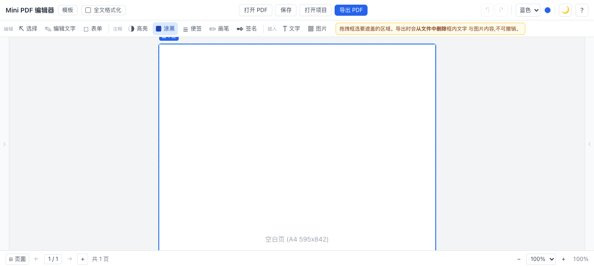
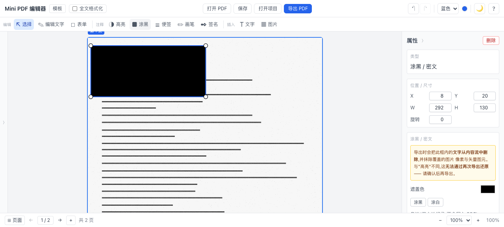
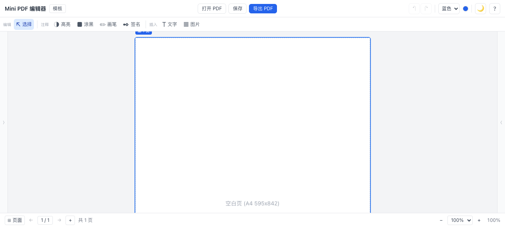
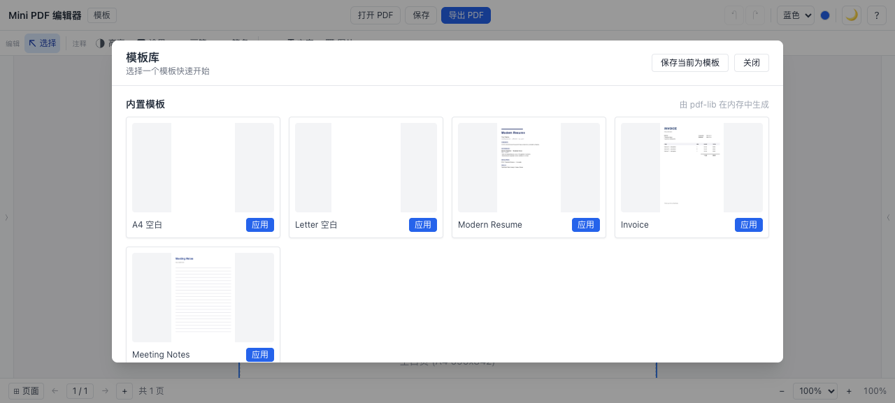
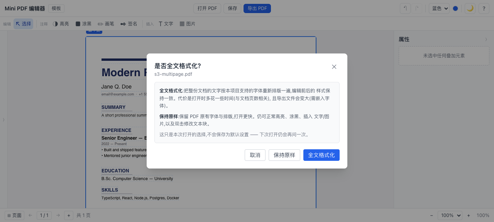
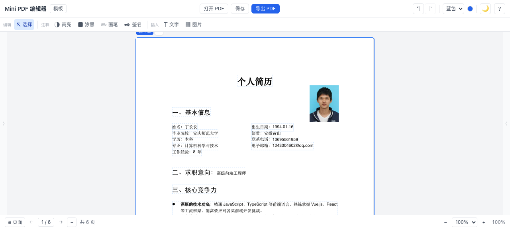
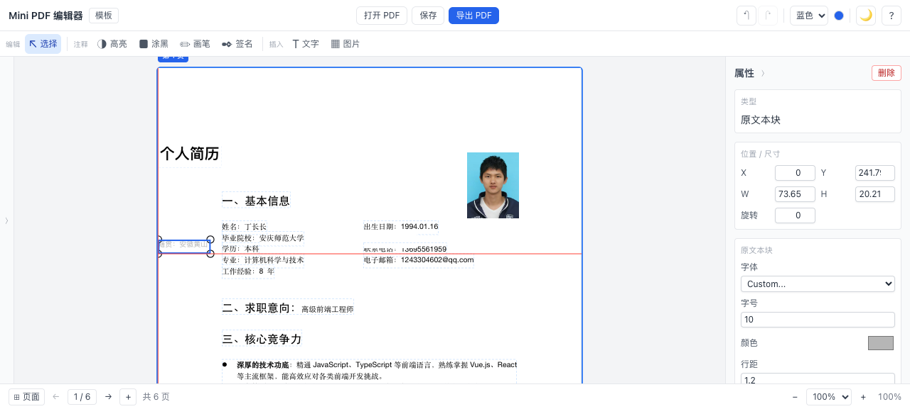
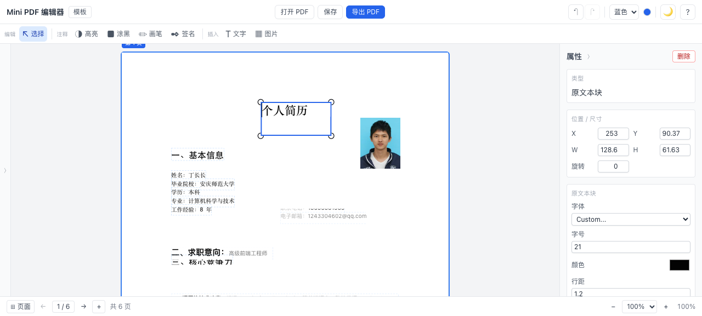
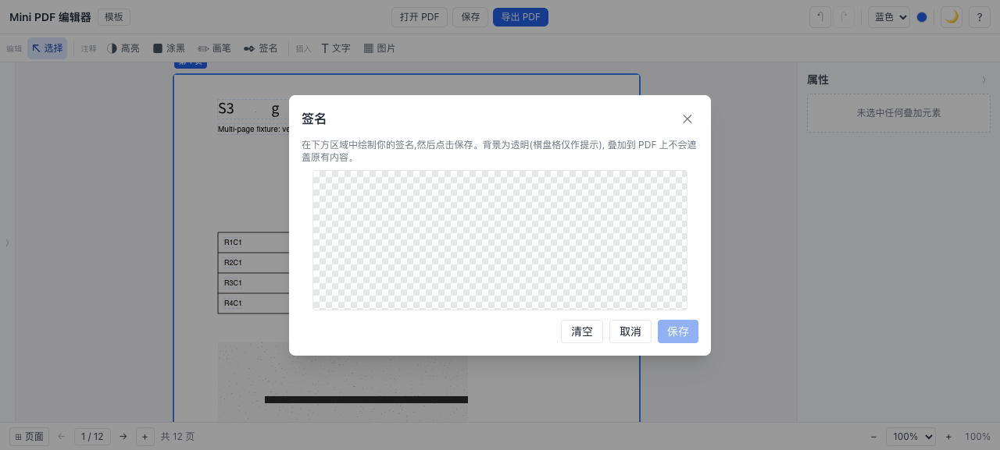

# Mini PDF 编辑器 / Mini PDF Editor

> 一个浏览器内本地运行的 PDF 编辑器,无需上传文件、无需登录、无后端。
> A browser-side, fully-local PDF editor - your files never leave your device.

> 任务进度 / Task progress: [`.trae/specs/build-minipdf-editor/tasks.md`](.trae/specs/build-minipdf-editor/tasks.md)

## 特性 / Features

| # | 中文 | English |
|---|------|---------|
| F1 | PDF 查看器 (缩略图 / 翻页 / 缩放 / 快捷键) | PDF viewer (thumbnails / paging / zoom / shortcuts) |
| F2 | 文本注释 (高亮) | Text annotations (highlight) |
| F3 | 文本叠加 (字体 / 颜色 / 粗斜下划删除线 / 富文本段) | Text overlay (font / color / bold / italic / underline / strike / rich-text segments) |
| F4 | 图片叠加 (PNG / JPG / WebP,拖动 / 缩放 / 旋转) | Image overlay (PNG / JPG / WebP, drag / resize / rotate) |
| F5 | 页面管理 (新增 / 删除 / 重排 / 旋转) | Page management (add / delete / reorder / rotate) |
| F6 | 画笔与签名 (自由绘制 + 透明底色签名模态框) | Free draw + transparent-background signature pad |
| F7 | 导出 PDF (矢量保留 + 字符级覆盖管线) | Export PDF (vector-preserving + char-level overlay pipeline) |
| F8 | 项目存档 (`.minipdf.json` 格式) | Project save (`.minipdf.json` format) |
| F9 | 撤销 / 重做 (Immer patches) | Undo / Redo (Immer patches) |
| F10 | 真实文本编辑 (三引擎路由 + TipTap 富文本;「选择」下双击进入) | Real text edit (3-engine router + TipTap; double-click under Select) |
| F12 | 模板库 (5 个内置 + 用户模板 localStorage,含真实封面) | Template library (5 built-ins + user templates, with real covers) |
| F13 | 涂黑 / 密文 (字节级真脱敏:删字 + 抹图片像素 + 移除矢量) | Redaction (true byte-level: text removed + image pixels erased + vector art removed) |

### 已移除的能力 / Removed Features

以下功能在「按任务收敛」的重构中被**整体移除**,不只是隐藏入口:

| 能力 | 移除原因 | 迁移路径 |
|---|---|---|
| 便签 (sticky note) | 与「文字」叠加层能力重叠,且导出后不可再编辑 | 用「文字」工具;需要贴纸效果可用「高亮」 |
| 表单 (AcroForm 读取 / 写入) | 只做了"读原字段 + 导出重建",无法新建字段树;半成品比没有更容易误导 | 无(如需填写表单,请在专业 PDF 工具中处理) |
| 「编辑文字」独立工具 | 与「选择」语义重叠(验证计划 A8/B9 记录的正是这个歧义) | 在「选择」下**双击**文本块即可改字 |
| 「打开项目」按钮 | 与「打开 PDF」并列时极易混淆 | 「打开 PDF」+「保存」(`.minipdf.json`) |

「全文格式化」不再是 TopBar 上的常驻开关 —— 它是针对**单份文档**的一次性决定,改为打开 PDF 时弹窗询问(见 `src/components/ReformatPromptDialog.tsx`)。

### F13 能力详情 / Redaction Details

「涂黑」与「高亮」是**两种不同的东西**,README 特意把它们分开写:

- **高亮** 只是画一层半透明色块。原文仍在 PDF 内容流里,可以复制、可以提取。
- **涂黑** 在导出时把该矩形内的内容**从内容流中真正删除**,导出后不可恢复。

实现(`core/writer/redact.ts` 的 `'full'` 模式):

| MuPDF 参数 | 取值 | 效果 |
|---|---|---|
| `black_boxes` | `false` | 黑框由 `flatten.ts` 用用户画的矩形绘制,保证"看到的框"与"被删的范围"一致,并支持自定义颜色(涂白) |
| `image_method` | `REDACT_IMAGE_PIXELS` (2) | 只抹除被覆盖的像素,图片其余部分保留 —— 扫描件靠这个才能局部遮盖 |
| `line_art_method` | `REDACT_LINE_ART_REMOVE_IF_TOUCHED` (2) | 被触及的矢量图元一并移除(宁可多删) |
| `text_method` | `REDACT_TEXT_REMOVE` (0) | 从内容流删除文字 |

**为什么不用现成的文本编辑路径**:文本编辑调用的是 `applyRedactions(false, 0, 0, 0)`,即"只删字、图片与矢量原样保留"。实测(见 `scripts/experiment-redact.mjs`)该参数下被覆盖的图片像素 **1400 → 1400 px 全部存活**、矢量 **381 → 381 px 存活**。直接复用它做涂黑工具会产出**假脱敏**:黑框画上了、文字也删了,但框下的图片与矢量仍在文件里。

**安全约束**:涂黑 overlay 存在时,redaction 失败会**直接抛错中止导出**,不走"白底兜底"降级。宁可导出失败,也不能交付一份"看起来已脱敏、实际仍可提取原文"的文件。

### F10 能力详情 / Real Text Edit Details

- **三引擎路由** 按优先级自动选择,首次失败自动降级:
  1. **MuPDF.js (WASM)** - 字节级 `Redact + applyRedactions` 真删字
  2. **PDFium** - `FPDFPageObj_Destroy` 删除原页面对象 + 重画
  3. **pdf-lib overlay** - 白底覆盖 + 重画(最末兜底,非字节级)
- **TipTap 富文本编辑器** 支持 bold / italic / underline / strike / color / fontSize / fontFamily 七种内联样式,空格与换行完整保留(`preserve-spans` + `preserveWhitespace:'full'`)
- **按段落分割文本块** 同行 atom 水平间距 > 3 倍平均字符宽度时拆分为独立块;段落合并要求字号(1.1x 内)、粗细、斜体、对齐一致,行距阈值基于实际字符宽度自适应
- **字符级 quad 收集** (`core/writer/textQuad.ts`) 精确白底覆盖原字位置,避免色块溢出
- **CJK 字体支持** (`@pdf-lib/fontkit`) 内嵌中文字体子集化,导出 PDF 文字可复制可搜索
- **Web 安全字体映射 (ADR 0001)** PDF 字体名归一化到 5 类 fontClass(`sans`/`serif`/`mono`/`cjk-sans`/`cjk-serif`),TipTap 与 pdf-lib 用同一份字体文件保证视觉一致。原 PDF 嵌入字体不再抽取重嵌。
- **Span 级颜色抽取 (ADR 0002)** `extractTextColors` 按 atom bbox 精确匹配,段内混色(红字+黑字)保留。`segment.color` 透传到 TipTap 浮层与导出端。
- **全文本重画 (ADR 0003) -- 已回退**:原计划所有 detected text-block 都在导出时重画,以避免编辑边界字体跳变。但因目前缺少 Source Han Sans Bold 字重 + 颜色抽取精度不足,重画会丢失原 PDF 的 bold/color/size 信息,已暂时回退为"仅重画编辑过的块"。"矢量保留"暂时恢复为完整原 PDF 字节保留(未编辑部分)。
- **矢量保留** 编辑只改 overlay,导出时统一通过 `core/writer/textBlockEdits.ts` 应用。原 PDF 矢量元素(图片、矢量图形、表格线)全部保留;未编辑的文本块保留原嵌入字体(完整样式),仅编辑过的块走映射字体重画。

## 技术栈 / Tech Stack

| 层 / Layer | 选型 / Choice |
|------------|---------------|
| 构建 / Build | Vite 8.1 |
| 框架 / Framework | React 19.2 |
| 语言 / Language | TypeScript 5.9 |
| 样式 / Styling | Tailwind 3.4 (with `darkMode: 'class'` + 多主题色系统) |
| PDF 渲染 / Render | pdfjs-dist 6.1 |
| PDF 写入 / Write | pdf-lib 1.17 + @pdf-lib/fontkit 1.1 (CJK) |
| PDF 引擎 (增强) / Engine | mupdf 1.27 (WASM, 懒加载) + @embedpdf/pdfium 2.14 |
| 富文本 / Rich text | @tiptap/react 3.27 + starter-kit / color / font-family / text-style / underline |
| 状态 / State | zustand 5 |
| 不可变 / Immutability | immer 11 |

## 截图 / Screenshots

**工具栏按任务分组(R3)** — 「编辑 / 注释 / 插入」三组 + 每个按钮带可见文字标签,解决 A8/B9 的图标歧义;涂黑工具激活时内联提示不可撤销。



**涂黑 / 密文(F13)** — 在扫描件(无文字层)上拖拽框选,导出时该区域内容被真正抹除;右侧 Inspector 显示遮盖色与警示。



**工具栏收敛后的完整布局** — 「编辑」组只剩「选择」;`E`/`F`/`N` 三个工具与 TopBar 的「打开项目」按钮已移除。



**模板封面(F12)** — 内置模板的封面在打开模板库时用 pdfjs 渲染第一页并缓存,不再是首字母占位。



**打开 PDF 时的全文格式化确认** — 从常驻开关改为一次性弹窗,并写明代价与"不会记住"。



**全文格式化是非破坏性的** — 「全文格式化」只检测全部文本并写入可编辑 overlay,**原始 PDF 字节不动**,Viewer 继续显示原文档(外观零改变),双击任意文字块即可编辑;只有被改过的块在导出时才按项目字体重画,未改动的块保持原 PDF 外观。早期的破坏性实现(整份按项目字体重排)对任意版式都会"乱码 + 格式乱",已废弃(见 `src/features/text-edit/reformatDocument.ts`)。



**选择 工具的拖动 + 智能对齐线** — 「选择」下整块可拖移,移动时显示红色对齐参考线:与页面边缘 / 中心 / 其它块的左·中·右(上·中·下)在 6 px 内即吸附并高亮一条贯穿全页的参考线。text-block 的命中区就是它自己的 bbox(全文格式化后的小块也能轻松抓取),非 text-block 的命中区在 SelectionFrame 中外扩 7 px,便于抓取小元素(见 `src/features/overlays/alignment.ts` 共享吸附计算)。



**选择 工具缩放手柄** — 「选择」下选中文本块后,块四角出现白色圆点手柄、四边出现白色胶囊手柄,拖动即可缩放(角手柄等比、边手柄单侧拉伸);缩放时按同样的对齐参考线逻辑(`computeEdgeSnap`)吸附页面边缘 / 中心 / 其它块的对应边,并画出贯穿全页的红色参考线。缩放手柄与拖动都位于 HTML 的 `TextBlockEditLayer`(它盖在 SVG `SelectionFrame` 之上),所以 SVG 的旧手柄对文本块已不可达 —— 缩放在此层完整重写。块高度变化时其下方同页、横向重叠的文本块会整体下移(`pushDownSubsequentBlocks`),避免重叠。



**导出反馈更明确** — 「导出 PDF」成功后,toast 与状态栏都明确写出 `文件名 · 可读体积`(如 `xxx-edited.pdf · 1.02 MB`,`toast` 寿命 6 s),而不是泛泛的"PDF 已导出";同时把 `URL.revokeObjectURL` 从 0 ms 推迟到 1 s(见 `src/utils/download.ts`),避免与浏览器下载管理器读取 blob 的过程赛跑导致静默取消下载。

**签名透明底色(F6)** — 画布用棋盘格提示透明,保存为带 alpha 的 PNG;叠加到 PDF 上不遮盖原有内容。



> 其余占位待补 / Remaining placeholders (TODO):
> <!-- screenshot: TopBar + Toolbar + Sidebar + Viewer + Inspector + BottomBar -->
> <!-- screenshot: text-block edit with TipTap floating toolbar -->
> <!-- screenshot: multi-theme color switcher -->
> <!-- screenshot: dark mode -->

## 快速开始 / Quick Start

```bash
# 安装依赖 / install deps
npm install

# 开发服务器 (http://localhost:5173) / dev server
npm run dev

# 生产构建 / production build
npm run build

# 类型检查 / typecheck
npm run typecheck

# Lint
npm run lint

# 单元测试 / unit tests
npm run test
npm run test:watch
npm run test:ui

# 生成 + 校验验证样例素材 (S1–S6) / generate & verify validation fixtures
npm run fixtures
npm run fixtures:verify
```

默认端口 / Default port: `5173`(可在 `vite.config.ts` 中修改)。

## 脚本 / Scripts

| 命令 / Command | 说明 / Description |
|----------------|--------------------|
| `npm run dev` | 启动 Vite 开发服务器 / Vite dev server |
| `npm run build` | 类型检查 + 生产构建 / tsc + vite build |
| `npm run preview` | 预览生产构建结果 / preview production build |
| `npm run typecheck` | `tsc -b --force`(严格类型检查) |
| `npm run lint` | ESLint |
| `npm run test` | Vitest 单次运行 |
| `npm run test:watch` | Vitest 监听模式 |
| `npm run test:ui` | Vitest 可视化界面 |
| `npm run fixtures` | 生成 + 校验验证样例素材 S1–S6 |
| `npm run fixtures:verify` | 仅校验 `fixtures/` 下现有素材 |

## 快捷键 / Shortcuts

按 `?` 打开快捷键面板 / Press `?` to open the shortcuts panel.

### 工具切换 / Tools

| 键 / Key | 中文 | English |
|----------|------|---------|
| V | 选择 | Select |
| H | 高亮 | Highlight |
| R | 涂黑 / 密文 | Redact |
| T | 文字 | Text |
| I | 图片 | Image |
| D | 画笔 | Draw |
| S | 签名 | Signature |

> `E`(编辑文字)/ `F`(表单)/ `N`(便签)已随对应功能一并移除,按键现在**无响应**,
> 而不是静默切到一个不存在的工具。

### 文本编辑 / Text editing

| 键 / Key | 动作 / Action |
|----------|---------------|
| 双击文本块 | 进入内联编辑(需先切到「选择」) / Edit block inline (under Select) |
| `Ctrl` / `Cmd` + `Enter` | 提交编辑 / Commit edit |
| `Esc` | 取消编辑 / Cancel edit |

### 翻页 / Paging

| 键 / Key | 动作 / Action |
|----------|---------------|
| `←` / `PageUp` | 上一页 / Previous page |
| `->` / `PageDown` | 下一页 / Next page |

### 缩放 / Zoom

| 键 / Key | 动作 / Action |
|----------|---------------|
| `+` / `=` | 放大 / Zoom in |
| `-` / `_` | 缩小 / Zoom out |
| `Ctrl` / `Cmd` + `0` | 实际大小 / Actual size |

### 撤销 / 重做 / Undo / Redo

| 键 / Key | 动作 / Action |
|----------|---------------|
| `Ctrl` / `Cmd` + `Z` | 撤销 / Undo |
| `Ctrl` / `Cmd` + `Shift` + `Z` | 重做 / Redo |
| `Ctrl` + `Y` | 重做 (备选) / Redo (alt) |

### 其他 / Misc

| 键 / Key | 动作 / Action |
|----------|---------------|
| `Ctrl` / `Cmd` + `S` | 保存项目 / Save project |
| `Delete` / `Backspace` | 删除选中 / Delete selected overlay |
| `Esc` | 取消选中 / Clear selection |
| `?` | 打开快捷键面板 / Open shortcuts panel |

## 目录结构 / Directory Structure

```
.
├── public/
│   ├── fonts/            # 思源黑/宋 CN Regular+Bold 共 4 个 OTF (~41 MB)
│   ├── templates/        # 旧版示例 PDF (供 StartPage 备用)
│   └── pdfium.wasm
├── fixtures/             # 验证样例素材 (S1–S6, gitignored,由脚本生成)
├── scripts/
│   ├── gen-templates.mjs     # 生成 public/templates 下的占位 PDF
│   ├── gen-fixtures.mjs      # 生成验证样例 S1–S6
│   ├── verify-fixtures.mjs   # 校验 S1–S6 是否真的可测 (20 项断言)
│   └── experiment-subset.mjs # CJK 字体子集化安全性实验
├── docs/
│   ├── adr/              # 架构决策记录 0001–0004
│   ├── validation-plan.md
│   └── optimization-plan.md
├── src/
│   ├── app/              # 应用引导 (预留)
│   ├── assets/           # 静态资源
│   ├── components/       # 通用组件 (TopBar / Toolbar / BottomBar / Inspector /
│   │                     #   SignatureDialog / ReformatPromptDialog / EmptyState /
│   │                     #   ErrorBoundary / Toaster / ShortcutsModal / LoadingOverlay)
│   ├── core/             # 核心引擎
│   │   ├── pdf/          # pdfjs 渲染 (loader / renderer / textColor)
│   │   ├── writer/       # pdf-lib 写入 (flatten / pages / text-overlay /
│   │   │                 #   textBlockEdits / textQuad / redact / cjkFont / helpers)
│   │   ├── mupdf/        # MuPDF.js 封装 (loader / mupdfEngine - 真删字 redact)
│   │   ├── pdfium/       # PDFium 封装 (loader / pdfiumEngine - 备用引擎)
│   │   ├── engine/       # 引擎路由 (router / types / pdfLibFallback /
│   │   │                 #   fontClassify - 字体名 -> fontClass 映射)
│   │   ├── project/      # 序列化 (serialize)
│   │   ├── templates/    # 模板库 (registry - 5 个内置 / user - localStorage 用户模板 /
│   │   │                 #   thumbnail - 封面渲染,内置模板封面按需生成)
│   │   └── types.ts
│   ├── features/         # 功能模块
│   │   ├── viewer/       # F1 (Viewer / Sidebar / CanvasInteractionLayer)
│   │   ├── overlays/     # 通用叠加层 (OverlayLayer / SelectionFrame / ElementRenderer)
│   │   ├── text-edit/    # F10 (RichTextEditor / TextBlockEditLayer / detectTextBlocks /
│   │   │                 #   useAutoDetectTextBlocks / useCommitTextBlock / reflow / runEngineDetection)
│   │   ├── export/       # F7 (exportPdf)
│   │   ├── templates/    # F12 (TemplateGallery)
│   │   └── project-io/   # F8 (saveProject)
│   ├── hooks/            # React hooks (useKeyboardShortcuts / useEngineLoad)
│   ├── store/            # Zustand stores (document / editor / engine / history / pen)
│   ├── utils/            # 工具函数 (coordinates / download / toast / theme / serialize)
│   ├── App.tsx
│   ├── main.tsx
│   └── index.css
├── tests/
│   ├── unit/             # 单元测试 (coords / serialize / history / export-pages /
│   │                     #   detectTextBlocks / registry / toast / engineStore /
│   │                     #   mupdfEngine / pdfiumEngine / readUtf16LE / zoom /
│   │                     #   flatten-font / subset-embed / shortcuts)
│   ├── integration/      # 集成测试 (store-flow / pdfbytes / resume)
│   └── setup.ts          # Vitest 全局 setup (pdfjs legacy build)
├── vitest.config.ts
├── tailwind.config.js
├── tsconfig*.json
├── vite.config.ts
└── package.json
```

## 架构概览 / Architecture

```
+----------------+        +----------------+        +-----------------+
|  React 组件    | <----> |   zustand     | <----> |   pdfjs-dist    |
| (TopBar/Viewer |        |   stores      |        |   (渲染)        |
|  Inspector/...) |        |  (doc/editor/ |        +-----------------+
+----------------+        |  history/...) |
                          +-------+--------+
                                  |
                                  v
                          +----------------+        +-----------------+
                          | engine router  | -----> |   pdf-lib       |
                          | ensureEngine() |        | (写入 / flatten)|
                          +-------+--------+        +-----------------+
                                  |
                  +---------------+---------------+
                  v               v               v
          +----------+    +-----------+    +----------------+
          |  MuPDF   |    |  PDFium   |    | pdf-lib overlay|
          |  (WASM)  |    |           |    | (白底覆盖兜底) |
          | 真删字   |    | 删对象+重画|   +----------------+
          +----------+    +-----------+
                                  |
                                  v
                          +----------------+
                          | Immer patches  |   <-- 撤销/重做
                          +----------------+
```

**引擎路由 (`core/engine/router.ts`)**:
- `'render'` 模式始终返回 `pdfLibFallback`(实际渲染由 `core/pdf/renderer.ts` 直接走 pdfjs)。
- `'edit'` 模式按优先级试探,首次解析成功后会被缓存:
  1. **MuPDF.js** - 真正的字节级删字 (Redact + applyRedactions)
  2. **PDFium** - 备用,通过 `FPDFPageObj_Destroy` 删字 + 重画
  3. **pdf-lib overlay** - 最末兜底,白底覆盖 + 重画,非字节级
- 加载期间通过 `LoadingOverlay` 全屏进度条反馈,失败时自动降级。

**核心设计原则**:

- **PDF 渲染** 走 pdfjs(直接 canvas)。
- **PDF 编辑**(文本块覆盖、矢量保留)走引擎路由自动选择。
- **编辑只改 overlay** 文本块编辑时不直接回写 pdfBytes,导出时统一通过 `core/writer/textBlockEdits.ts` 应用(字符级白底 + 重画),原 PDF 矢量元素全部保留。
- **撤销/重做** 基于 Immer patches,所有 `documentStore` mutation 都通过 `applyWithHistory` 包装。
- **叠加 (Overlay)** 始终存储为独立对象(高亮/涂黑/文字/图片/画笔/文本块),导出时通过 `flatten.ts` 转换为 pdf-lib draw 命令。**唯一例外是涂黑**:它除了画框,还会在 flatten 之前触发 MuPDF 字节级删除(见 F13)。
- **`loadDocument` 永远给 pdfjs 一份私有副本**。pdfjs 会 transfer(detach)传入的 ArrayBuffer,而调用方在它返回后仍要继续使用同一份字节(存进 store、base64 编码成模板)。早期把调用方的 buffer 直接透传,导致模板流程抛 `Cannot perform Construct on a detached or out-of-bounds ArrayBuffer`(见 `tests/unit/loader-buffer.spec.ts`)。
- **模板** 内置模板在 `core/templates/registry.ts` 中以 pdf-lib 内存生成;用户模板存于 `localStorage['canva.userTemplates']`;封面由 `core/templates/thumbnail.ts` 渲染,内置模板封面在打开模板库时按需生成并缓存。
- **错误隔离** 顶层 `<ErrorBoundary>` 捕获渲染错误;`<Toaster>` 集中显示成功/失败提示。
- **Canva 风格布局** 分区式 UI:`TopBar` / `Toolbar` / `[Sidebar | Viewer | Inspector]` / `BottomBar`,可整体切换多主题色 + 暗色模式。

## 决策日志 / Decision Log

1. **三引擎路由而非单引擎**  
   最初计划用 MuPDF.wasm 做真实文本编辑,但 npm 上的 `mupdf` 包是 Node 原生绑定,不能直接进浏览器 bundle。经过评估后采用三引擎策略:优先尝试 MuPDF.js(字节级真删字),失败降级到 PDFium(对象级删除 + 重画),最后兜底 pdf-lib overlay(白底覆盖)。这样既保留了"真编辑"能力,又保证了任何环境下都能工作。

2. **pdfjs-dist 6.1 (AGPL) 不触发披露义务**  
   pdfjs 通过 `pdfjs-dist` npm 包分发,消费未修改的 AGPL 软件不构成分发,本项目不修改 pdfjs 源码,只通过标准 API 调用。详见 [pdfjs licensing FAQ](https://github.com/mozilla/pdf.js/wiki/Frequently-Asked-Questions#what-are-the-implications-of-using-pdfjs-in-my-application)。

3. **矢量保留 + 编辑分离 + 导出统一管线**  
   重构后编辑只更新 overlay,不回写 pdfBytes。导出时 `textBlockEdits.ts` 根据文本块是否被改动决定是否需要字符级白底覆盖原字并重画新字。优点:原 PDF 矢量元素(图片、矢量图形、表格)全部保留;撤销/重做简单;编辑体验流畅。代价:导出时需要遍历所有文本块。  
   **ADR 0003 修订**:"矢量保留"范围收窄为"非文本元素保留"。所有 detected text-block 都在导出时重画(无论是否编辑),原 PDF 字体被规范化到映射字体,避免编辑边界字体跳变。

4. **TipTap 富文本编辑器**  
   选 TipTap 而非 contenteditable 自实现,因为:扩展生态成熟(starter-kit / color / font-family / text-style / underline)、JSON 结构可序列化、ProseMirror 底层保证 schema 一致性。自定义 `PreserveText` 扩展强制 `preserveWhitespace:'full'`,避免富文本段间空格被 HTML 规则折叠。

5. **按段落分割文本块 + 样式一致性检查**  
   原方案"一行一个 block"过于碎,用户体验差。改为按 baseline 聚类 + 水平间距拆分(阈值 = 3 倍平均字符宽度,基于实际字符宽度自适应)。段落合并要求字号 1.1x 内、粗细/斜体/对齐一致,行距 0.8x-2.0x 字号。这样段落级的编辑一次完成,而非逐行。

6. **字符级 quad 收集**  
   `core/writer/textQuad.ts` 通过 pdfjs `getTextContent()` 的 `transform` 矩阵反推每个字符的四个角点,用于精确白底覆盖。比按行 bbox 覆盖更精确,不会盖到相邻文字。

7. **CJK 字体子集化**  
   `@pdf-lib/fontkit` + `core/writer/cjkFont.ts` 在导出时嵌入中文字体子集(只包含实际使用的字形),避免 PDF 体积爆炸。子集化后的 PDF 文字仍可复制可搜索。  
   *实测佐证*:`scripts/experiment-subset.mjs` 用 200 个汉字验证 —— 子集内字形轮廓数恰为 201(200 字 + `.notdef`),pdfjs 提取文字逐字符全等、无零宽度字形;体积 **68.5 KB vs 整字体嵌入 7,289 KB(106x)**。此前 `textBlockEdits.ts` / `flatten.ts` 一度使用 `subset: false` 并注释"子集可能丢字形",该判断已被该实验证伪。

8. **撤销/重做基于 Immer patches 而非深拷贝**  
   patches 体积小、可序列化(可后续支持云端协作),且 Immer patches 与 zustand 配合简单。代价:不能撤销跨 store 的副作用(目前也用不到)。

9. **localStorage 存用户模板而非 IndexedDB**  
   用户模板通常 < 1 MB,localStorage 容量足够;且模板项的序列化更简单。隐私模式下写入失败会自动降级为内存存储,不影响当次会话。

10. **Tailwind 暗色模式用 class 而非 media**  
    通过 `<html class="dark">` 切换给用户显式控制权,持久化到 `localStorage['canva.theme']`;不跟随系统变化,避免误触。多主题色系统在此基础上扩展。

11. **Web 安全字体映射而非抽取重嵌原嵌入字体 ([ADR 0001](docs/adr/0001-web-safe-font-mapping.md))**  
    原 PDF 嵌入字体名(如 `ABCDEF+PingFangSC-Regular`)浏览器不识别,直接当 CSS font-family 永远走默认 sans-serif 兜底;`extractEmbeddedFont` 对 CID/Type1 字体常因 cmap 缺失产生乱码。改为 5 类 fontClass 映射:`sans`/`serif`/`mono`/`cjk-sans`/`cjk-serif` -> Arial / Times New Roman / Courier New / 思源黑体 / 思源宋体。TipTap 与 pdf-lib 共用同一份 `.otf` 文件,保证编辑浮层与导出 PDF 视觉一致。`fontExtract.ts` 删除。CJK 字体每个 fontClass 都有 Regular + Bold 两份字重文件,导出时按 `bold` 标志选对应字重。

12. **Span 级颜色抽取而非块级主导色 ([ADR 0002](docs/adr/0002-span-level-color-extraction.md))**  
    原 `matchColorsToBlocks` 取块内主导色,段内混色(红字+黑字)丢失。改为 `matchColorsToAtoms`:在 MuPDF 检测末尾按 atom bbox 精确匹配 showText 颜色,透传到 `segment.color`。`block.color` 降级为块级默认。代价:atom-level 匹配 O(atoms × coloredTexts),典型页面可接受。

13. **导出时重画所有 detected text-block,而非仅编辑过的 ([ADR 0003](docs/adr/0003-redraw-all-text-at-detection.md))** *(已回退)*  
    原"未编辑不重画"导致编辑边界字体跳变(用户改一字 -> 该段变 Arial,相邻段仍是原嵌入字体)。改为所有 detected text-block 都走 redaction + 重画。但因颜色抽取精度不足,重画会丢失原 PDF 的 color 信息,已暂时回退为"仅重画编辑过的块"。Bold 已通过真字重文件落地,不再需要模拟。

14. **CJK italic 模拟**  
    Source Han Sans/Serif CN 作为 CJK 字体,设计上没有 italic 变体(CJK 排版传统里没有斜体概念)。Bold 用真字重文件,italic 用 `page.pushOperators` 设置 CTM 斜切矩阵(`1 0 0.21 1 -0.21*y 0 cm`)模拟,与浏览器 CSS `font-synthesis: oblique` 行为一致。

15. **涂黑与文本编辑共用引擎但参数分离(`text-only` vs `full`)**  
    文本编辑需要"只删字、别动图片和矢量",而涂黑需要"连图片像素和矢量一起抹掉"。二者共用 `applyMupdfRedactions`,但 `RedactEdit` 带 `mode` 字段,按 `(页, 模式)` 分组后每组单独建注释、单独调用 `applyRedactions`。  
    *实测佐证*:`scripts/experiment-redact.mjs` 用对照组证明 `(false, 0, 0, 0)` 下被覆盖的图片像素 **1400 → 1400 px 全部存活**、矢量 **381 → 381 px 存活**;`(false, 2, 2, 0)` 下图片 1400 → 0、矢量 381 → 0,且未被覆盖的图片半边 1400 → 1400 完好。mixed 用例进一步验证 MuPDF 会逐注释遵守各自参数(无涂黑框的矢量 381 → 381 未被误删)。  
    *为什么必须区分*:若复用文本编辑的参数做涂黑,产出的是**假脱敏** —— 黑框与删字都生效,但框下图片/矢量仍在文件里。因此导出管线还有一条硬约束:涂黑 overlay 存在时 redaction 失败即抛错中止,不走白底兜底降级。

15. **分页检测 + 后台重画流水线 ([ADR 0004](docs/adr/0004-paginated-detection-redraw-pipeline.md))** *(规划中)*  
    ADR 0003 让导出成本随页数线性增长。规划:PDF 打开后立即同步检测当前页,Web Worker 后台逐页检测其余页。导出等待所有页就绪(进度 UI)。MuPDF WASM 在持久 worker 中复用。

## 已知限制 / Known Limitations

- **WebP 导出**:图片可上传 WebP 但 `pdf-lib` 仅支持 PNG/JPG,导出时 WebP 会被跳过并打印警告。
- **MuPDF 加载体积**:MuPDF WASM 包 ~10MB(构建产物 `dist/assets/mupdf-wasm-*.wasm` 实测 9.99MB),首次在「选择」工具下自动检测文本块(即双击编辑的前置步骤)时加载,有进度条 + 失败降级。
- **签名底色透明**:签名画布用 `clearRect` 保持 alpha=0,保存为 RGBA PNG(色彩类型 6),`pdf-lib embedPng` 通过 SMask 保留透明通道 —— 实测签名覆盖在黑色条带上时,条带从笔画间隙正常透出。验证脚本:`scripts/verify-signature-alpha.mjs`(含"旧的白底行为"对照组,证明检查能区分二者)。
- **涂黑导出体积**:`image_method = PIXELS` 会重新编码被覆盖的图片,扫描件导出体积显著增大 —— 实测 fixture S5(170.6 KB)导出为 4.3 MB(约 25 倍)。这是"局部真脱敏"的代价:`REMOVE` 模式体积不变(171.2 KB)但会把整张图片删掉,`NONE` 则完全不脱敏。可行优化:当涂黑框完整覆盖某张图片时对该图改用 `REMOVE`。详见 `scripts/verify-redacted-export.mjs`。
- **涂黑不覆盖批注层**:redaction 作用于页面内容流。若 PDF 自身带有文本批注(annotation),其内容不在内容流中,不受涂黑影响。
- **多行段落文本块**:段落内的多行若字号/粗细/斜体不一致,会被拆分为多个独立块;单独编辑某行时其他行保持原状。
- **无批量编辑 API**:目前没有 JS API 供外部脚本调用,只能通过 UI 交互。
- **依赖 happy-dom / pdfjs legacy build 测试**:浏览器专用 API (Worker、Canvas 渲染) 在测试中被降级,某些路径无法覆盖。
- **画笔精度**:贝塞尔曲线被线性化,放大后可见到多边形锯齿。
- **字体规范化 ([ADR 0001](docs/adr/0001-web-safe-font-mapping.md))**:编辑过的文本块导出时被规范化到 5 类映射字体(Arial / Times / Courier / 思源黑体 / 思源宋体)。Bold 用真字重文件,italic 用 CTM 斜切模拟(Source Han 无 italic 变体)。未编辑的块保留原 PDF 字节(原嵌入字体 + 完整样式)。
- **CJK 字体文件体积**:`public/fonts/` 下 4 个 OTF 文件共 ~41MB(思源黑 Regular/Bold + 思源宋 Regular/Bold),随项目分发;`vite build` 会把 `public/` 全量拷入产物,故 `dist/` 中字体占约 41MB。导出时按需 `fetch` 并按 `(fontClass, weight)` 子集嵌入,导出产物本身只增加数十 KB。
- **分页检测流水线待落地**:ADR 0004 的 Web Worker 多线程检测尚未实现,大文档导出仍可能在主线程阻塞数秒。

## 路线图 / Roadmap

### 短期 / Short-term

- [ ] 截图补全:Canva 风格布局、TipTap 富文本编辑、多主题色、暗色模式
- [ ] 单元测试覆盖新增模块:`textBlockEdits` / `textQuad` / `redact` / `cjkFont` / `fontClassify` / `textColor` / `RichTextEditor` (TipTap 往返)
- [ ] TipTap 编辑器边界情况:多段粘贴、富文本段与纯文本混合、fontSize 精度
- [ ] 引擎降级路径集成测试:模拟 MuPDF 加载失败 -> PDFium -> pdf-lib overlay
- [ ] 改进 `matchColorsToAtoms` 精度(目前按 bbox 相交 + 主导色,可改字符级精确匹配)
- [ ] 实现 ADR 0003 的"全文本重画"(需先解决颜色抽取精度)
- [ ] 实现 ADR 0004 分页检测 + Web Worker 后台重画流水线

### 中期 / Mid-term

- [ ] MuPDF WASM 体积优化 / CDN 分发
- [ ] 图片 OCR / 表格识别(Tesseract.js 或外部 API)
- [ ] 协同编辑(WebSocket + CRDT,基于 Immer patches 已可序列化的基础)
- [ ] 插件市场(允许第三方注册工具,通过 `EngineInterface` 接入新引擎)

### 长期 / Long-term

- [ ] 移动端适配(触摸优化、手势缩放)
- [ ] PWA 离线支持(`vite-plugin-pwa` + Service Worker 缓存 WASM)
- [ ] PDF 加密 / 密码保护

## 测试 / Testing

```bash
npm run test          # Vitest 单次运行
npm run test:watch    # 监听模式
npm run test:ui       # 可视化界面
```

测试覆盖 / Coverage:

**单元测试 / Unit** (`tests/unit/`):
- `coords.spec.ts` - 屏幕 ↔ PDF 坐标对称性
- `serialize.spec.ts` - base64 往返 + JSON 结构
- `history.spec.ts` - undo/redo 多步
- `export-pages.spec.ts` - `applyPages` 输出 PDF 页数等于 PageMeta 列表
- `detectTextBlocks.spec.ts` - 双行 PDF -> 2 个 block
- `registry.spec.ts` - 内置模板生成
- `toast.spec.ts` - toast pub-sub
- `engineStore.spec.ts` - 引擎状态机
- `mupdfEngine.spec.ts` - MuPDF 引擎检测
- `pdfiumEngine.spec.ts` - PDFium 引擎检测
- `readUtf16LE.spec.ts` - UTF-16 LE 解码
- `zoom.spec.ts` - 缩放档位步进(含"从默认 100% 放大"的回归用例)
- `flatten-font.spec.ts` - 导出时按 `(fontClass, weight)` 选字体变体
- `subset-embed.spec.ts` - CJK 导出走子集嵌入,体积保持 KB 级
- `redact-modes.spec.ts` - 涂黑参数映射(`text-only` vs `full` 的四元参数逐项断言、按 (页, 模式) 分组、失败返回原始字节)
- `shortcuts.spec.ts` - 快捷键绑定(`I`/`S` 打开外部 UI、`R` 切涂黑、`Ctrl+S` 保存、输入框内不拦截)

**集成测试 / Integration** (`tests/integration/`):
- `store-flow.spec.ts` - store 集成(create -> addOverlay -> undo -> redo)
- `pdfbytes.spec.ts` - PDF bytes 往返
- `redact-export.spec.ts` - 涂黑导出:无文本编辑时也会执行 redaction、模式标注正确、**redaction 失败必须抛错而非导出假脱敏**、仅有文本编辑时保留白底兜底降级
- `resume.spec.ts` - PDFium 引擎在真实简历 PDF 上的端到端流程。**默认跳过**:PDFium 在 Node/Vitest 下间接函数表初始化不稳定,且 fixture 路径依赖本机文件。跳过时会打印原因;设 `MINIPDF_RESUME_PDF=<path>` 可本地运行。

**实验脚本 / Experiments** (`scripts/`,不进 CI,用于做决策):
- `experiment-subset.mjs` - 决定 CJK 是否可安全子集嵌入
- `experiment-redact.mjs` - 决定 `applyRedactions` 四个参数的语义(含对照组,证明 `(false,0,0,0)` 会产出假脱敏)
- `verify-redacted-export.mjs` - 校验一次真实导出:被覆盖区域内容确实消失、区域外未被误删。含"不画黑框"的隔离检查,以排除"黑框盖住未删除内容"的假象

## 致谢 / Acknowledgments

- [Mozilla pdf.js](https://github.com/mozilla/pdf.js) (AGPL-3.0) - PDF 渲染
- [pdf-lib](https://github.com/Hopding/pdf-lib) (MIT) - PDF 编辑
- [@pdf-lib/fontkit](https://github.com/Hopding/fontkit) (MIT) - CJK 字体子集化
- [MuPDF.js](https://github.com/ArtifexSoftware/mupdf.js) (AGPL-3.0) - 字节级 PDF 编辑
- [@embedpdf/pdfium](https://github.com/embedpdf/pdfium) - PDFium WASM 封装
- [TipTap](https://tiptap.dev/) (MIT) - 富文本编辑器
- [Zustand](https://github.com/pmndrs/zustand) (MIT)
- [Immer](https://github.com/immerjs/immer) (MIT)
- [Tailwind CSS](https://tailwindcss.com/) (MIT)
- [React](https://react.dev/) (MIT)
- [Vite](https://vitejs.dev/) (MIT)

## 许可证 / License

本项目代码本身以 MIT 许可证发布;运行时依赖 pdfjs-dist (AGPL-3.0)、mupdf (AGPL-3.0)、pdf-lib (MIT) 等的许可证各自保留。分发时请附上完整 NOTICE。

The source code of this project is MIT-licensed; runtime dependencies retain their own licenses (notably pdfjs-dist and mupdf under AGPL-3.0, which does not impose additional obligations when consumed unmodified as a library).
